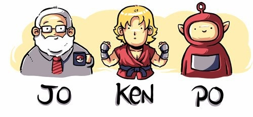

<h1 align="center">
    
</h1>

  

  

# Jokenpo
Atividade Projetar e desenvolver um jogo no estilo Pedra x Papel x Tesoura. O aluno pode modificar o tema e regras do jogo de acordo com seu interesse. 

### O jogo deverá:
  * Conter regras de vitória e derrota mostrados em tela para o jogador;
  * O jogador deverá jogar contra uma IA (PC x Enviroment);
  * Deverá ser mostrada a pontuação do jogador e da IA a cada partida.

### :memo: Licença
[Licença MIT](LICENSE)